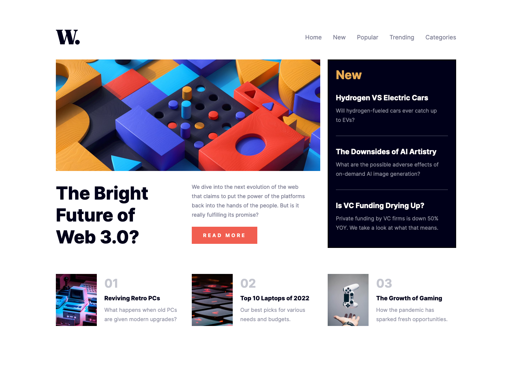

# Frontend Mentor - News homepage solution

This is a solution to the [News homepage challenge on Frontend Mentor](https://www.frontendmentor.io/challenges/news-homepage-H6SWTa1MFl). 

## Table of contents

- [Overview](#overview)
  - [The challenge](#the-challenge)
  - [Screenshot](#screenshot)
- [My process](#my-process)
  - [Built with](#built-with)
  - [What I learned](#what-i-learned)
- [Author](#author)


## Overview

### The challenge

Users should be able to:

- View the optimal layout for the interface depending on their device's screen size
- See hover and focus states for all interactive elements on the page

### Screenshot




## My process

### Built with

- Semantic HTML5 markup
- CSS custom properties
- Flexbox
- CSS Grid
- Mobile-first workflow

### What I learned

- [To set the grid:]()

```css
@media (min-width: 376px) {
    #grid {
        grid-template-columns: repeat(3, 1fr);
        grid-template-rows: repeat(4, auto);
        grid-template-areas: 
            "box1 box1 box1"
            "box2 box2 box3"
            "box4 box5 box3"
            "box6 box7 box8";
        margin: 80px 150px;
    }
```

Note that each elements need to be assigned to his area in the grid:

```css
/* BOX-1 */

   #box-1 {
    grid-area: box1;
   } 
```

- [To set a sidebar menu while obscuring the background:]()

```html
<body>

  <div id="grid"></div>

  <div id="filter"></div>

</body>
```

All the boxes of the grid are contained into the div "grid". Filter is used as an obscuring layer betweeen the grid and the opening menu. "box-1__menu" is the sidebar menyu. When the menu icon is clicked, both the elemnts are displayed by means of "display: flex".

```css
#box-1__menu {
    display: none;
    flex-direction: column;
    background-color: rgb(255, 253, 250);
    position: absolute;
    top: 0;
    right: 0;
    width: 70%;
    height: 100vh;
    z-index: 2;
}

#filter {
    display: none;
    position: absolute;
    top: 0;
    height: 100vh;
    width: 100vw;
    background-color: rgba(0, 0, 25, 0.279);
    z-index: 1;
}
```

- [Note that when you have to assign a background image to a grid-cell, it is better to do it in css and not in html, so that you can easily change it if you need to.]()


## Author

- GitHub - [martinavaira](https://github.com/martinavaira)
- Frontend Mentor - [@martinavaira](https://www.frontendmentor.io/profile/martinavaira)


